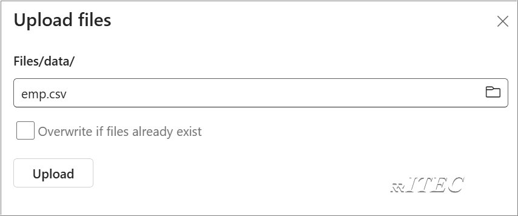

# Lakehouse

## Introduction

- Traditionally, organizations have been building modern **Data Warehouses** for their transactional and **structured** data analytics needs. And **data lakehouses** for big data (**semi/unstructured**) data analytics needs. These two systems ran in parallel, creating silos, data duplication, and increased total cost of ownership.
- Fabric with its unification of data store and standardization on **Delta Lake** format allows you to eliminate silos, remove data duplication, and drastically reduce total cost of ownership.
- With the flexibility offered by Fabric, you can implement either lakehouse or data warehouse architectures or combine them together to get the best of both with simple implementation.
- It uses the **medallion architecture** where the bronze layer has the raw data, the silver layer has the validated and deduplicated data, and the gold layer has highly refined data. You can take the same approach to implement a lakehouse for any organization from any industry.

## Exercise 1: Create Lake House

1. On the left navigation pane, click on Workspaces.
2. Select the Workspace where you want to create the Lakehouse.
3. Inside the selected Workspace, click 

4. Search for Lakehouse >  Click on Lakehouse

5. Enter a **Lakehouse name** (e.g., rritec_Lakehouse).

6. Click **Create**.
7. Observe that with in Lakehouse, two child objects created those are Semantic Model and SQL Analytics Endpoint
8. A SQL analytics endpoint for SQL querying and a default Power BI semantic model for reporting.

- 

## Exercise 2: Upload file from local Machine

1. Open Lakehouse by clciking on it.
2. Create a subfolder with the name of **data**

3. Download the file emp.csv from labdata folder
4. Right click on data folder and upload the emp.csv file

4. 

## Exercise 3: Create table using csv file

1. Right click on emp.csv file > Load to Tables > New Table

2. Provide schema as **dbo** and table name as **emp** click on **Load**
3. Right click on emp table observe properties

4. Do research on what is **Delta** table .
5. Right click on emp table observe view files and research on **parquet** file format.
6. Read [about Delta table](https://learn.microsoft.com/en-us/azure/synapse-analytics/spark/apache-spark-what-is-delta-lake)
7. Understand ACID with [handson ACID](https://github.com/rritec/Microsoft-Fabric/blob/main/M02_LakeHouse/01_Delta_table_ACID_operations.md)

## Questions
1. you know navigation to get **SQL connection string** ???
2. Session job connection string vs Batch job connection string
3. 

## Answers
1. Click on **Settings** > SQL Analytics Endpoint
2. Click on **Settings** > Livy Endpoint 
    - Use Session Jobs if you need real-time interaction (e.g., testing, debugging, and exploratory analysis).
    - Use Batch Jobs for scheduled workloads like ETL pipelines, data transformations, or running full scripts.)
3. 

