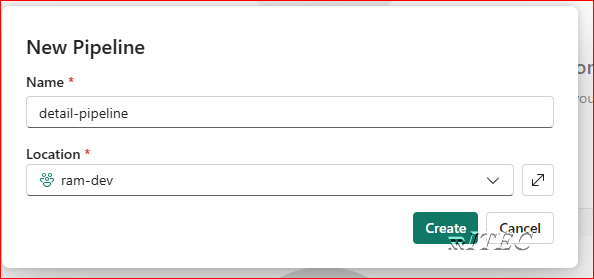
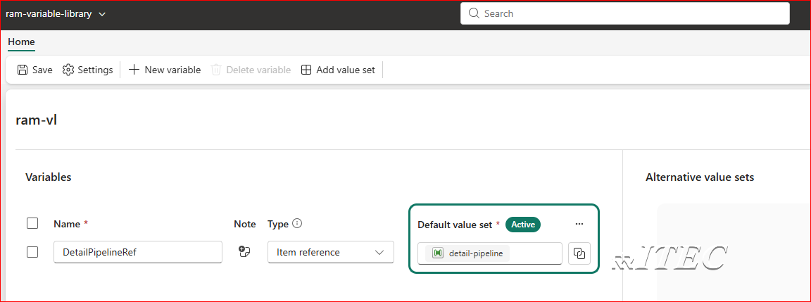

# Item reference variable type (summary)

**What it is**
- An Item Reference variable stores a static pointer to an existing Fabric item (for example: lakehouse, notebook, or pipeline) by saving the Workspace ID and Item ID (two GUIDs).
- Use it to parameterize internal connections and deployments across environments (Dev/Test/Prod).

## Prerequisites
- Two workspaces available for the lab: `ram-dev` and `ram-test`.
- Ensure you have Contributor access in `ram-dev` and at least Reader access on items in `ram-test` when testing deployments.

## How it works (brief)
- The variable value is stored as two IDs: `workspaceId` and `itemId`. These GUIDs uniquely identify the referenced Fabric item.
- The reference is static — it does not automatically change when you move deployments between workspaces or stages.
- For stage-specific targets (Dev/Test/Prod), create separate value-sets and activate the appropriate set for each stage.

## Permissions (quick)
- To create or edit variables in a variable library: Contributor role or higher in the workspace.
- To reference and use an item: you must also have at least Read permission on the referenced item.

## Classroom exercises — expanded step-by-step
Below are six guided exercises. Each exercise lists small, verifiable steps students can follow.

1. Exercise 1: Create a simple child pipeline (`detail-pipeline`)
	- Open the `ram-dev` workspace → click **New item** → select **Pipeline**.
	- Name it `detail-pipeline`.
	
	- Add a simple activity set variable
	- Save and publish the pipeline.
	- Verify it by runing manually

1. Exercise 2: Create a Variable Library and add an Item Reference variable
	- Open the `ram-dev` workspace → click **New item** → select **Variable Library**.
	- Name it `ram-variable-library`.
    - Click on **New variable**
    - Name it `DetailPipelineRef` > Select Type as `Item Reference` > Click on Select item and select `detail-pipeline`
      
	

	- Click on `Add value set` > name it is ram-dev

        

    - save it.
      
       


1. Exercise 3: Inspect the variable from a notebook (see stored IDs)
	- Create a notebook with the name `understand-item-reference`
      
    - in first cell paste below code and run it and understand the `map` object
    ```python
    var_ref = "$(/**/ram-variable-library/DetailPipelineRef)"
    var_obj = notebookutils.variableLibrary.get(var_ref)
    print(var_obj)
    ```
    - In second cell paste below code and run it and understand IDs
    ```python
    workspace_id = var_obj.get("workspaceId").value()
    item_id = var_obj.get("itemId").value()
    print(workspace_id)
    print(item_id)
    ```

     


1. Exercise 3: Create a master pipeline (`master-pipeline`) that calls the child via variable
	- Create `master-pipeline`
        
    - 
    and add an activity that invokes or triggers the pipeline referenced by the variable (e.g., a Pipeline activity or notebook that reads the IDs and calls the child).
	b. Configure the activity to read `DetailPipelineRef` from the Variable Library at runtime.
	c. Save, publish, and test the master pipeline to confirm it triggers the child pipeline.

6) Create a deployment pipeline and deploy to a Test workspace
	a. Use your CI/CD process (or manual export) to prepare deployment artifacts (variable library JSON and pipeline definitions).
	b. In the Test workspace, import the variable library and pipelines.
	c. Activate the appropriate value-set if you created stage-specific value-sets.
	d. Run the deployed `master-pipeline` in Test and confirm it calls the correct `detail-pipeline` there.

7) Change variable library item references
	a. In the Test or Prod workspace, edit `DetailPipelineRef` and choose a different target item or a different value-set.
	b. Save and re-run the master pipeline to verify it now uses the updated referenced item.

## Code example — resolve an Item Reference in a notebook
```python
var_ref = "$(/**/VarLibItem/DetailPipelineRef)"
var_obj = notebookutils.variableLibrary.get(var_ref)
workspace_id = var_obj.get("workspaceId").value()
item_id = var_obj.get("itemId").value()
print("workspaceId:", workspace_id)
print("itemId:", item_id)
```

## Best practices & notes
- Keep values within a value-set the same item type to prevent runtime issues.
- Remember: only the IDs are stored in the variable JSON — names and metadata are resolved at runtime.
- Use descriptive variable names (e.g., `DetailPipelineRef`) and add notes so teammates understand the target.

## Screenshots (placeholders)
- Add your screenshots to: `M11_DevOps/media/` and replace the placeholder paths used above (e.g., `item-picker.png`).

## References
- Official Microsoft Learn: Item reference variable type — https://learn.microsoft.com/en-us/fabric/cicd/variable-library/item-reference-variable-type

---
_Edited to expand exercises, add clarifications and examples._
