# Item reference variable type (summary)

**What it is**
- An Item Reference variable stores a static pointer to an existing Fabric item (for example: lakehouse, notebook, or pipeline) by saving the Workspace ID and Item ID (two GUIDs).
- Use it to parameterize internal connections and deployments across environments (Dev/Test/Prod).

## Prerequisites
- Two workspaces available for the lab: `ram-dev` and `ram-test`.
- Ensure you have Contributor access in `ram-dev` and at least Reader access on items in `ram-test` when testing deployments.

## How it works (brief)
- The variable value is stored as two IDs: `workspaceId` and `itemId`. These GUIDs uniquely identify the referenced Fabric item.
- The reference is static — it does not automatically change when you move deployments between workspaces or stages.
- For stage-specific targets (Dev/Test/Prod), create separate value-sets and activate the appropriate set for each stage.

## Permissions (quick)
- To create or edit variables in a variable library: Contributor role or higher in the workspace.
- To reference and use an item: you must also have at least Read permission on the referenced item.

## Classroom exercises — expanded step-by-step
Below are six guided exercises. Each exercise lists small, verifiable steps students can follow.

1. Exercise 1: Create a simple child pipeline (`detail-pipeline`)
    - Open the `ram-dev` workspace → click **New item** → select **Pipeline**.
    - Name the pipeline `detail-pipeline`.
    - Add a simple activity (for example, a short Lookup or Wait) and save and publish the pipeline.
    - Verify: run the pipeline manually and confirm it completes successfully.
    

2. Exercise 2: Create a Variable Library and add an Item Reference variable
    - Open the `ram-dev` workspace → click **New item** → select **Variable Library**.
    - Name it `ram-variable-library`.
    - Click **New variable**.
    - Name the variable `DetailPipelineRef`, select **Type** = `Item Reference`, click **Select item**, and choose `detail-pipeline`.
    
    - Click **Add value set**, name it `ram-dev`, then save the variable library.
    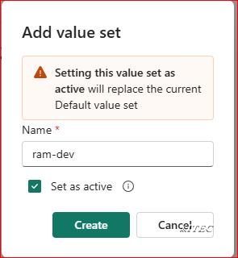
    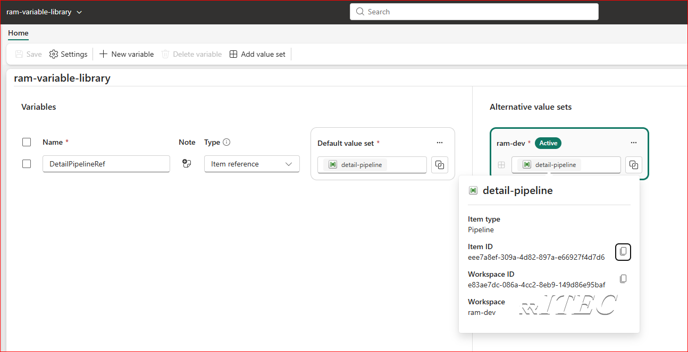

3. Exercise 3: Inspect the variable from a notebook (see stored IDs)
    - Create a notebook named `understand-item-reference`.
    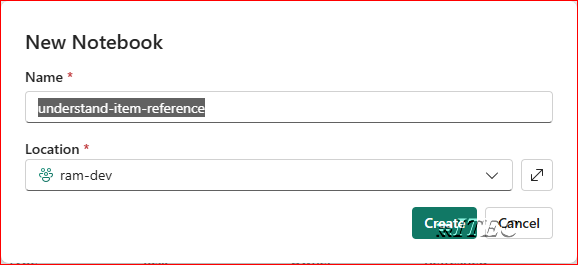
    - In the first cell paste and run the code below to retrieve the variable object:
    ```python
    var_ref = "$(/**/ram-variable-library/DetailPipelineRef)"
    var_obj = notebookutils.variableLibrary.get(var_ref)
    print(var_obj)
    ```
    - In the second cell run the code below to extract the stored GUIDs:
    ```python
    workspace_id = var_obj.get("workspaceId").value()
    item_id = var_obj.get("itemId").value()
    print(workspace_id)
    print(item_id)
    ```
    - Verify: confirm the two printed values are GUIDs and correspond to the `detail-pipeline` item.
    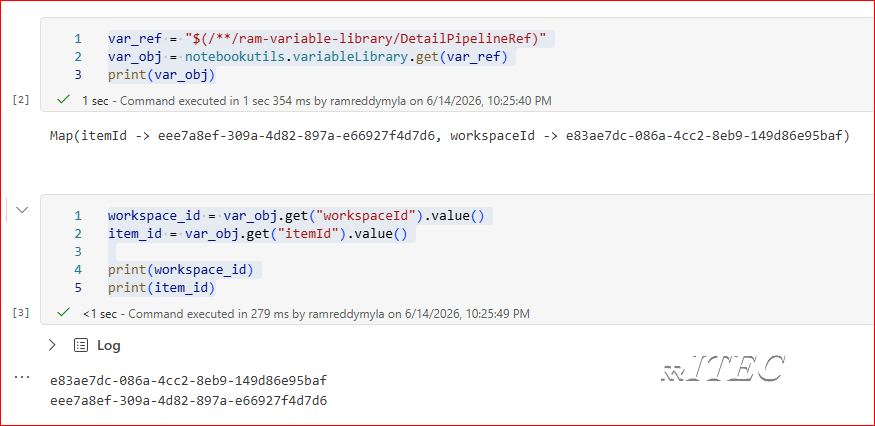

4. Exercise 4: Create a master pipeline (`master-pipeline`) that calls the child via variable
    - Create `master-pipeline` and add an `Invoke pipeline` activity.
    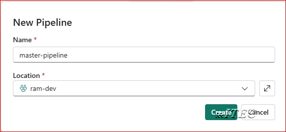
    - Under **Library variables** click **New** and create a variable named `vDetailPipelineRef` that references `ram-variable-library/DetailPipelineRef`.
    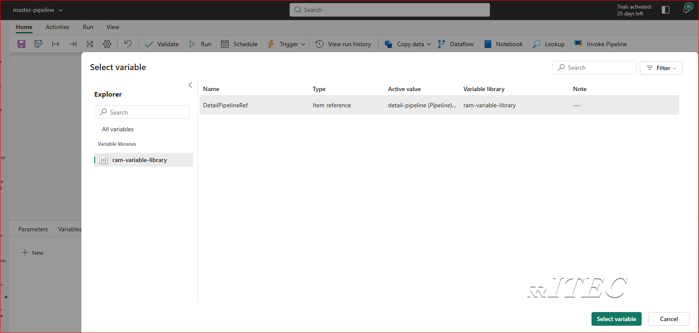
    - Configure the `Invoke pipeline` activity: in Settings, pick `FabricDataPipelines` for the service, then use dynamic content to set the workspace and pipeline values. Example dynamic expression referencing the variable:
    ```
    $(/**/ram-variable-library/DetailPipelineRef)
    ```
    - Save and run the `master-pipeline`; verify the child `detail-pipeline` runs as expected.
    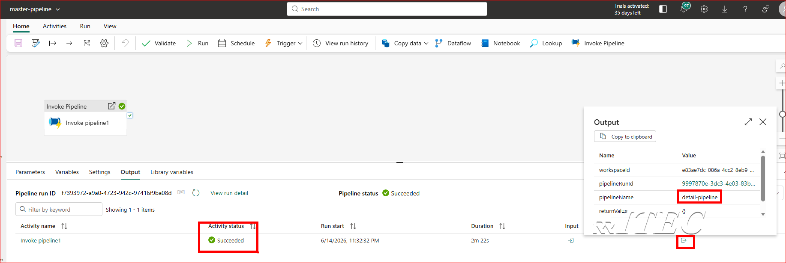

5. Exercise 5: Create a deployment pipeline and deploy to a `ram-test` workspace
    - Click **Workspaces** → **Deployment pipelines** → **New pipeline** and name it `ram-deployment-pipeline`.
    
    - Click **Create and continue**, then map the source and target workspaces.
    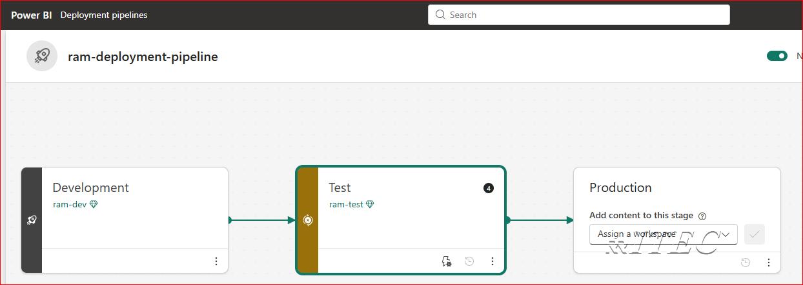
    - Select the `Test` environment, choose the objects to deploy (include the variable library and pipelines), and click **Deploy**.
    - Verify: wait for the deployment success notification and then confirm the objects appear in `ram-test`.
    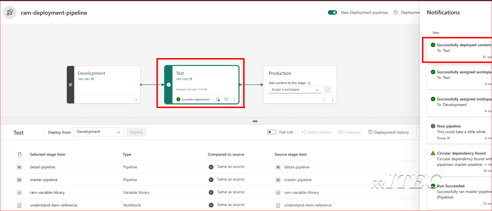

6. Exercise 6: Adjust value sets for the `ram-test` environment
    - Currently Fabric does not autobind item references during deployment. As a result, you must create and activate an environment-specific value set (for example, `ram-test`) in the Variable Library and update the item reference there.
    - Steps: in the source workspace create a `ram-test` value set for `ram-variable-library`, set the item reference to the `detail-pipeline` in `ram-test` (or update after deployment), then save.
    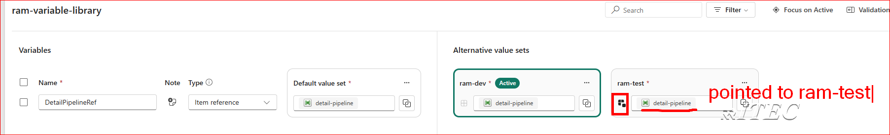
    - Deploy only the Variable Library object to the `ram-test` workspace, then in `ram-test` open the variable library and activate the `ram-test` value set.
    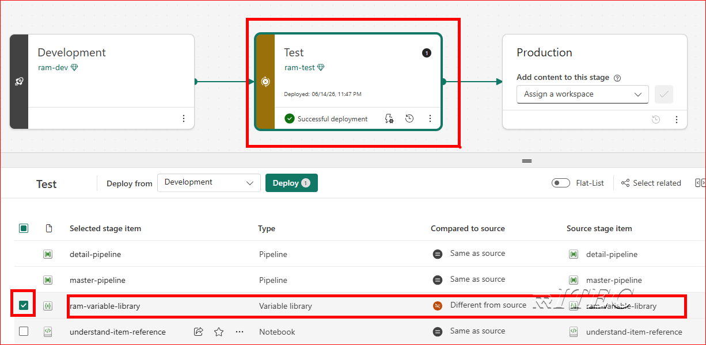
    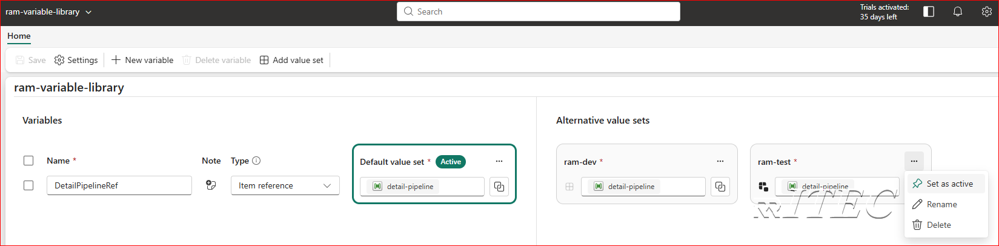
    - Verify: in `ram-test` confirm the active value set contains the correct workspace and item IDs for the test copies of the assets.

    
## References
- Official Microsoft Learn: Item reference variable type — https://learn.microsoft.com/en-us/fabric/cicd/variable-library/item-reference-variable-type


