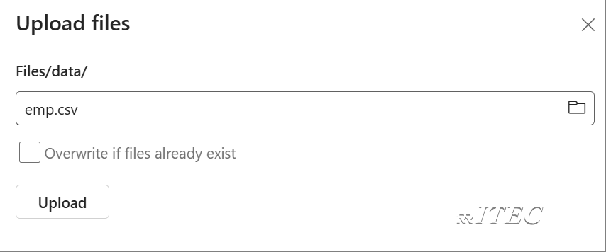

# Lakehouse

- Traditionally, organizations have been building modern data warehouses for their transactional and structured data analytics needs. And data lakehouses for big data (semi/unstructured) data analytics needs. These two systems ran in parallel, creating silos, data duplication, and increased total cost of ownership.
- Fabric with its unification of data store and standardization on Delta Lake format allows you to eliminate silos, remove data duplication, and drastically reduce total cost of ownership.
- With the flexibility offered by Fabric, you can implement either lakehouse or data warehouse architectures or combine them together to get the best of both with simple implementation.
- It uses the **medallion architecture** where the bronze layer has the raw data, the silver layer has the validated and deduplicated data, and the gold layer has highly refined data. You can take the same approach to implement a lakehouse for any organization from any industry.

## Exercise 1: Create Lake House

1. On the left navigation pane, click on Workspaces.
2. Select the Workspace where you want to create the Lakehouse.
3. Inside the selected Workspace, click 

4. Search for Lakehouse >  Click on Lakehouse

5. Enter a **Lakehouse name** (e.g., rritec_Lakehouse).

6. Click **Create**.
7. Observe that with in Lakehouse, two child objects created those are Semantic Model and SQL Analytics Endpoint
8. A SQL analytics endpoint for SQL querying and a default Power BI semantic model for reporting.

- 

## Exercise 2: Upload file from local Machine
1. Open Lakehouse by clciking on it.
2. Create a subfolder with the name of **data**

3. Download the file emp.csv from labdata folder
4. Right click on data folder and upload the emp.csv file

4. 
